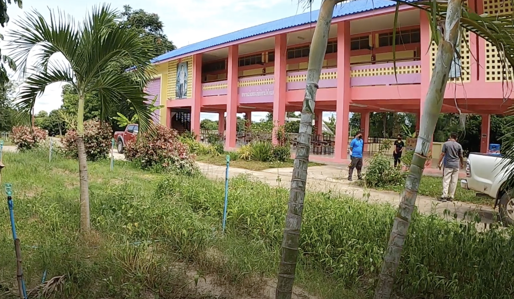
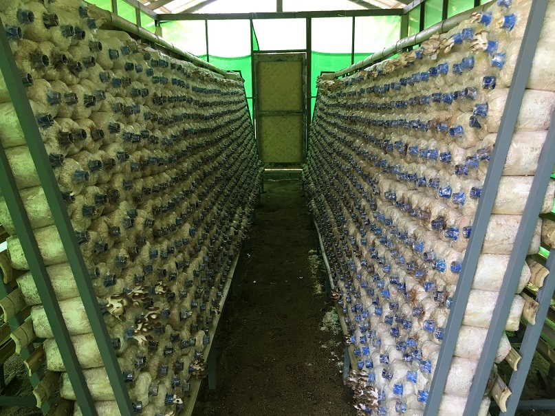
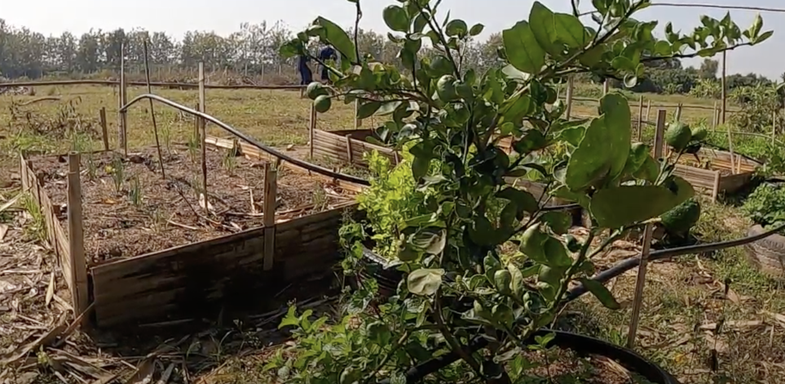

## Yua Taesaban School

San Pa Tong Yua Taesaban School, located in Chiang Mai Province in northern Thailand holds more than 150 students where they are able to receive two of their meals a day. The wide majority of students come from impoverished families. These students do not obtain sufficient levels of quality nutritious foods daily. Despite the school receiving government assistance, they still have little funds to cover costs.

Every year the school runs their own sustainable agricultural programmes to help eradicate these problems. These programmes are often held back by lack of funding and space. At the school, they have little knowledge in regards to managing sustainable agricultural programs, thus affecting their students' nutritional health.

## Mushroom Houses

The school has implemented various farming strategies to help cater food to the students. Mushroom houses provide oyster mushrooms for the students. Oyster mushrooms play a pivotal role in sourcing various essential macronutrients for the students like protein and fibre, as well as other antioxidants that can help to strengthen the immune system of the students.

## Benefits of Raised Beds

1. Improves soil drainage, allowing soil to dry and warm faster in the spring, and provide better soil conditions for vegetable crops that need well-drained soils.
2. Provides opportunity to raise vegetables in areas with little or no soil, unsuitable soil, or contaminated soil

From the image above, it is evident that these raised beds have not grown very well due to the school's limited knowledge on sustainable agriculture. Today, San Pa Tong Yua Taesaban is still unable to provide sufficient well-balanced meals for the students, the amount of food they ultimately produce in their gardens is not enough to feed all the students.

---

> Please help schools like this overcome their struggles by donating towards this cause.
