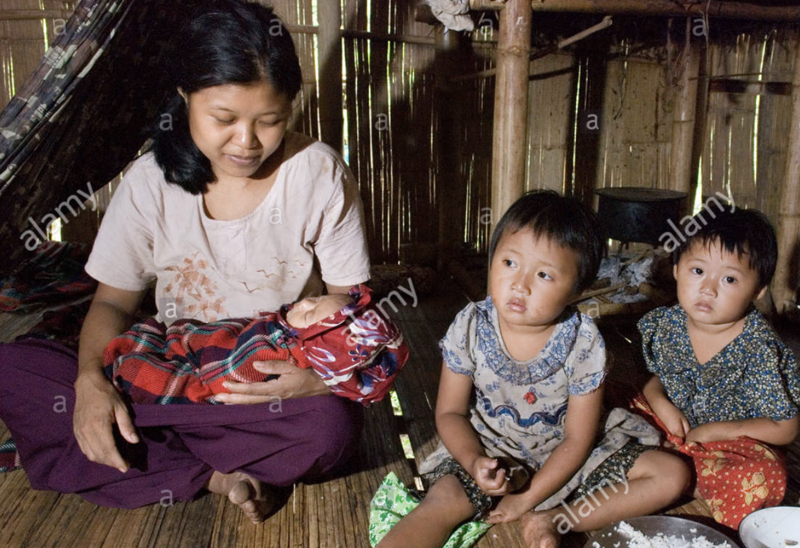
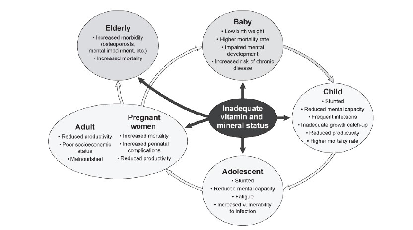
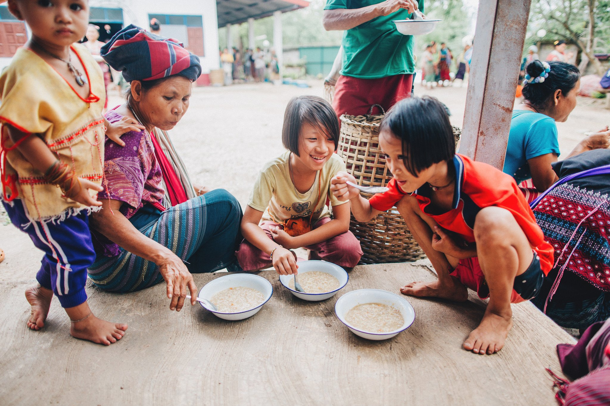
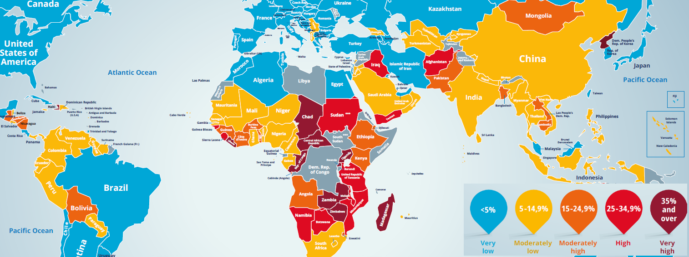
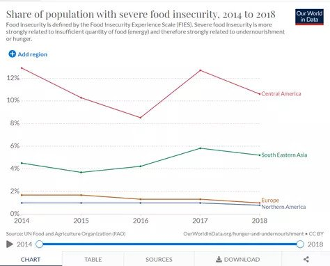
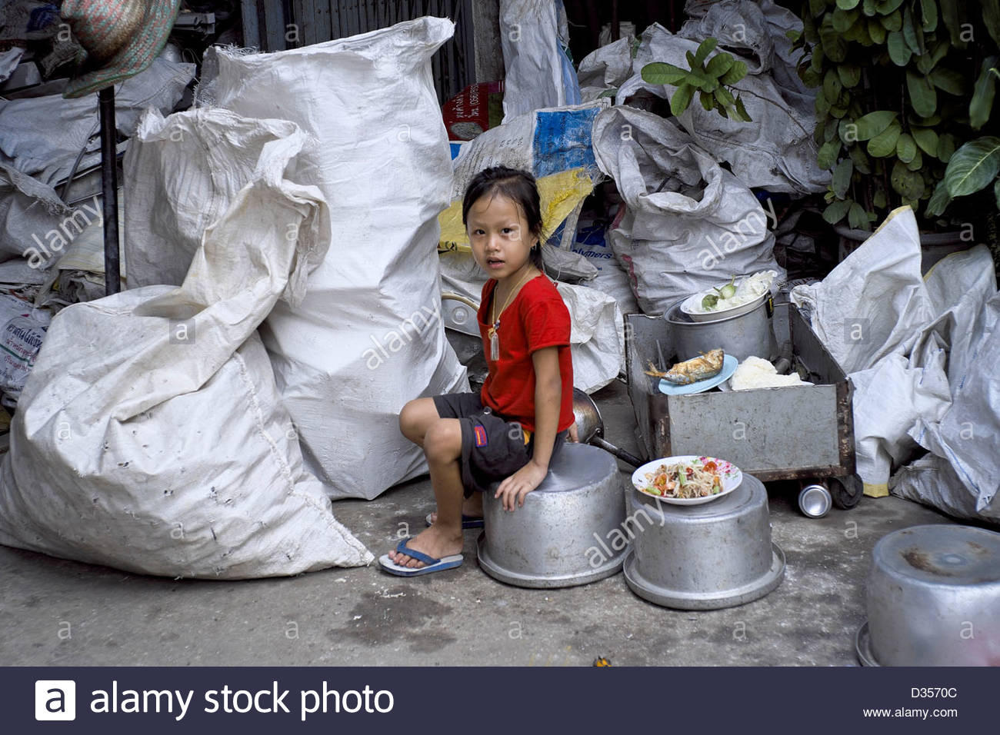

> **The Big Problem:**
> More than _815 million people_ around the world still suffer from malnutrition and hunger – _6.5 million in Thailand._ Why?

## Micronutrient Deficiencies

Micronutrient deficiencies during childhood can contribute to **impairments in growth,** immune competence, and **mental and physical development,** and the coexistence of several such deficiencies can adversely affect the efficacy of single micronutrient interventions.

### 1. Zinc

Zinc deficiency is a major risk factor for morbidity and mortality.

- Nearly 800,000 deaths per year among children under five years of age are the result of zinc deficiency.
- Zinc deficiency increases mortality associated with infections
- In Thailand, a study found that **57% of children** in 10 different East Thailand schools had **low serum zinc** and 83% had urinary iodine levels below the 100 μg/l cutoff. Suboptimal serum zinc and urinary iodine concentrations may result from low intakes of zinc and iodized salt.

### 2. Calcium

We often see calcium as a nutrient which just 'supplements' growth. However, it is proven that **calcium** is essential for the development , growth and maintenance of the bones in our body, while a children grows calcium helps to develop the bones of the child, once they stop growing calcium can continue to help and support the bones by slowing down the density bone loss. Another nutrient that may influence growth is protein, which is the building block of your muscles. Therefore, eating adequate amounts of protein helps you maintain your muscle mass and promotes muscle growth.

### 3. Iron and Anemia

Anemia is a condition characterized by a lack of hemoglobin (iron-bearing molecules) in the bloodstream. Hemoglobin is necessary to carry oxygen to cells throughout the body. Anemia is often caused by an inadequate consumption of iron from the diet. Iron deficient anemia is known to slow brain development in children and is a key predictor of morbidity and mortality.

- Across South Asia, it is estimated that 25,000 women die in childbirth due in part to severe Anemia.

> "10% of Thailand's population having their height affected by a lack of nutrition"

---

We set out an interview with some of the students at San Pa Tong Yua Taesaban School, where we get an insight into third grade "Ployhorm's" life. Ployhorm is **one of the 91 students** who board at the local orphanage, where she is provided with two meals a day. These children don't just go to school to learn — they go because it's one of the few places they can get a meal everyday.

> "Hello, my name is Ployhorm and I am in third grade. I have one meal a day in school"

## Struggles of South East Asia

_What is the extent of hunger in Asia?_

- **64%** of all malnourished children in the world live in Asia (FAO, 2017).
- **519.6 million adults and children** in Asia consume too few calories, which accounts for about 12% of the total population of Asia (FAO, 2017).
- More than half of all stunted children under 5 lived in Asia in 2017 (UNICEF/WHO/World Bank Group, 2018).
- In 2017, **Asia** accounted for **more than two thirds of all wasted children** under 5 (UNICEF/WHO/World Bank Group, 2018).
- Southern Asia had the **highest Global Hunger Index** (GHI) score of 30.9, indicating serious levels of hunger (Global Hunger Index, 2017).
- Southern Asia has the **highest rate (14.7%) of undernourishment** and the most numbers of the hungry in Asia. This region includes Afghanistan, Bangladesh, and India, among others (UNICEF/WHO/World Bank Group, 2018).

### Causes of malnutrition in Asia

Malnutrition is defined as any disorder of nutrition. It may result from an unbalanced, insufficient, or excessive diet, or from impaired absorption, assimilation, or use of foods. Over-nutrition, a condition of excess nutrient and energy intake over time, may be regarded as a form of malnutrition when it leads to morbid obesity. Undernutrition is a condition of malnutrition caused by an inadequate food supply or an inability to use the nutrients in food.

### Sanitation and hygiene

Poor and insufficient sanitation and hygiene practices, such as those found in many parts of Asia, can increase the spread of disease and infection.

- Lack of water, poor sanitation, and hygiene practices may cause up to 50% of all child malnourishment.
- Every year there are 2.5 billion cases of diarrhea in children under 5 – this causes key nutrients to be lost from the body.

### Urban versus rural malnutrition

In Thailand, people living in rural areas are more likely to be malnourished than those in urban environments, especially children.

- Two-thirds of the Thai school children in East Thailand were at risk of two or more coexisting micronutrient deficits. This could be due to a variety of factors. The factors that are statistically associated with better nutrition in urban areas are:

- **Maternal education:** It is more likely that an urban mother will have a secondary education and will have higher decision-making power in her household.
- **Hygiene and sanitation:** The urban household is more likely to have access to and use a flush toilet, as opposed to open defecation or a pit latrine.
- **Economic status:** Urban families also tend to have a better economic status than rural families.

## Food insecurity in South East Asia

This graph clearly depicts that South-Eastern Asia suffers more from food insecurity than the most developed regions in the world.

In South-East Asia, the pandemic has exacerbated a number of existing food security risks. Despite major improvements, there are major challenges to food security across the region. Poverty rates remain high, exceeding **40 per cent in some countries,** and roughly **60 million are undernourished.**

Dietary surveys have reported low intakes of iron, zinc, and vitamin A during childhood but very few studies have examined the prevalence of coexisting biochemical micronutrient deficiencies in this region.

In developing countries, poor dietary quality is often a major determinant of inadequate micronutrient intakes. Diets of poor quality are predominantly plant based, and often contain very small amounts of expensive animal source foods.

> The quality of children’s diets may be particularly poor in the North East region of Thailand where the per capita income and education level are among the lowest in the country (Department of Health, 1995).

We hope that through educating the public with this information, we can help to improve the quality of food and nutrition available to students in rural Thailand, by empowering them through sustainable agriculture.

Sources:

- [Rural poverty in Thailand](https://www.borgenmagazine.com/rural-poverty-in-thailand/)
- [Focus on food security](https://www.bangkokpost.com/business/2064375/focus-on-food-security)
- [Nation Thailand: In Focus](https://www.nationthailand.com/in-focus/30340610)
- [Hunger and Undernourishment](https://ourworldindata.org/hunger-and-undernourishment)
