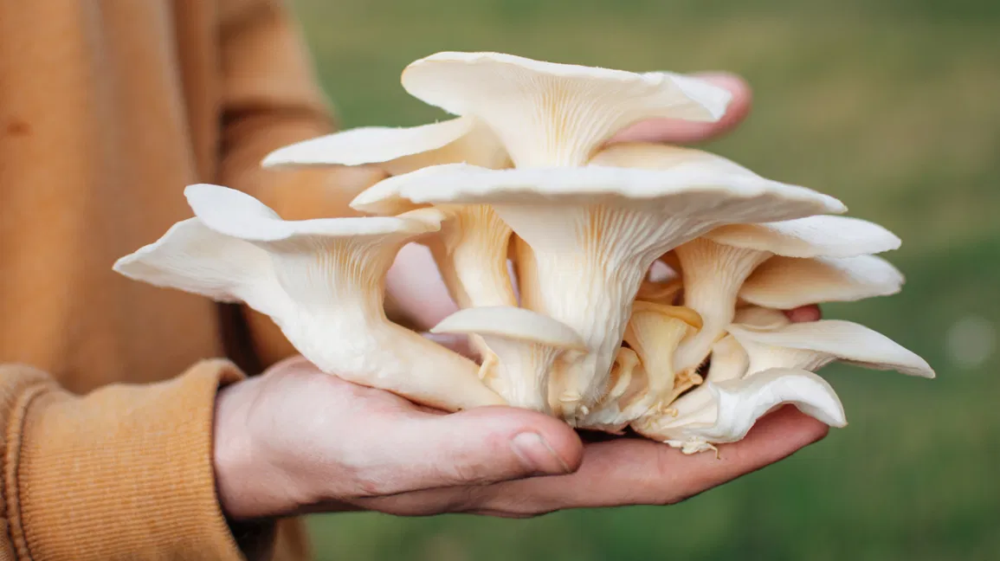
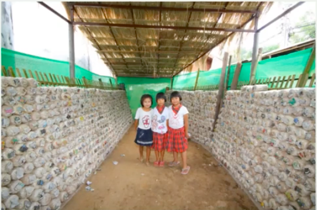

Mushroom Houses are extremely helpful for the schools in Thailand. They not only ensure nutritous meals for the students, but they also create an additional revenue stream.

> #### What are mushroom houses?

A mushroom house is a 2 by 4 metre house which is stocked with racks of pre-packed bottles in which oyster mushrooms are produced. In order to grow the mushrooms, the spores are used. However, in order for fungi to grow, they need to be kept under very specific conditions - one of them being cool temperatures, which is why the mushroom houses have roofs. Each bottle is carefully packed with sawdust, rice bran, calcium sulphate, magnesium sulphate and other ingredients. These can yield up to five harvests per bottle.

## Why are they so beneficial for students in Thailand?

#### 1. Diverse nutrition

Mushroom houses provide oyster mushrooms for students, a delicacy. They are a rich source of protein, vitamins, minerals. Other antioxidants, like selenium, protect a body's cells from chronic diseases and help strengthen immunity.

Not only are mushrooms delicious and offer improvements in quality of life, they are nutritious as well!

#### 2. More school funds

Schools can sell surplus mushrooms and raise funds to fill gaps in school infrastructure and food. Since the supply of these mushrooms is quite limited, there is a high demand, especially during low season.

> Fun fact: The money raised from selling mushroom houses allowed one of the schools to hire an additional English teacher!

#### 3. Educational opportunities

For many students, mushroom houses are more than just another source of food. It is an educational opportunity. Students are encouraged to learn how to maintain the mushroom houses, by doing temperature checks, weighing the mushrooms and more. They are given a hands on learning experience in order to develop the skills needed to grow oyster mushrooms.

#### _How can I help?_

By donating, you will be funding the building of mushroom houses which will greatly help in allowing students to have access to a nutritious source of food, funding school items that will create a better learning experience for students, as well as providing wonderful, hands-on educational opportunities. We hope you can help!
