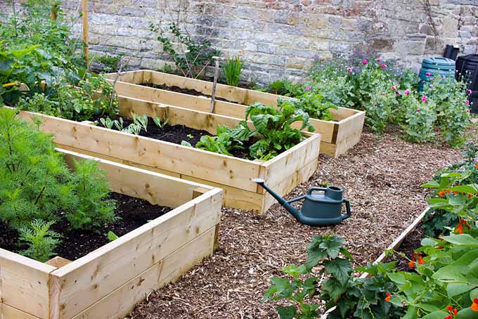
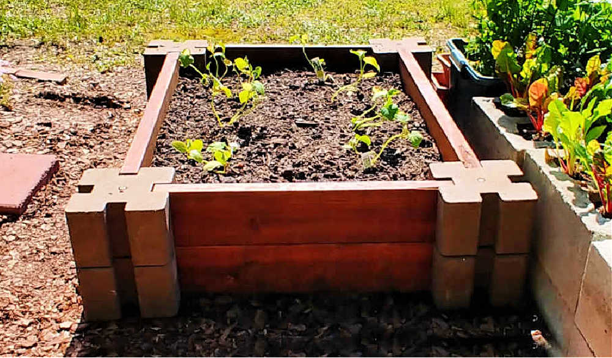

You might be wondering, why raised beds? Why not just use the soil on the ground? Well, I will explain why raised beds make gardening more manageable and enjoyable!

> #### What is a raised bed, anyway? Why are they so helpful for our partners in Thailand?

The concept behind a raised bed is simple. It is a form of gardening in which the soil is enclosed in a containment unit ('bed'). It can be anywhere between a few inches tall to a waist high, and it is usually made out of wood, bamboo or sturdy plastic.

Gardening in raised beds have many benefits, which really help our partner school Baan Mai Sawan. Raised beds allow for a longer growing season, soil amendment, and generally make gardening a lot more manageable.

## Benefits of raised bed gardening

#### 1. Longer growing season

Assuming that the soil is properly prepared, raised beds extend the growing season because they dry out more quickly and warm up faster in spring compared to flat beds. A properly prepared raised bed allows plant roots to breathe.

#### 2. Easier soil ammendments

Raised beds allow you to grow plants anywhere. You are able to cultivate vegetables on land typically not arable. Some schools are built on land not meant for agriculture, which causes problems with growing vegetables. However, raised beds solves this issue. Furthermore, you can customise a variety of factors (amount of soil per bed, pH, etc) depending on what is being grown.

#### 3. Manageability

To put it simply, raised beds offer a manageable way to garden a smaller space intensively. The height of the raised beds means that you don't have to get on your knees to remove produce, which is very helpful for many people. For example, at the Baan Mai Sawan school we work with, one of the ex teachers who still works with the agriculture programs, who also happens to be in her sixties - gardening is made easy for her. Because of the raised beds, she does not need to get on her hands and knees to pull out the weeds, since it is already at waist height!

The only drawback of raised beds is the cost of building them. They do not cost more than around $30SGD (726 baht), and the raised bed would be there for three years. It is a low investment for a high return.

### _How can I help?_

By donating, you will be funding the construction of raised beds which will not only make gardening more manageable, but will also result in a better crop - this will greatly benefit the community in Thailand.
